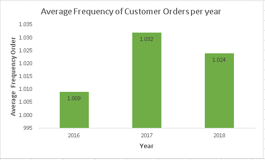

# 💰 E-Commerce-Annual-Performance
 

**Tool** : SQL Workbench   
**Visualization** : Microsoft Excel  
 
 
---

## 📂 **STAGE 0: Problem Statement**

### **Background**
Measuring business performance is a very important aspect for a company. It helps in monitoring and evaluating the success or failure of various business processes. Business performance measurement can be carried out by considering several business metrics. In this project, an analysis of the business performance of an eCommerce company will be conducted using business metrics such as customer growth, product quality, and payment types based on historical data over a period of three years.

### **Objective**
Gather insights from the analysis and with visualizations in the form of:
1. **Annual Customer Activity Growth**
2. **Annual Product Category Quality**
3. **Annual Payment Type Usage**
 
 

---

## 📂 **STAGE 1: Data Preparation**

The dataset used is from a Brazilian eCommerce company that contains order information with a total of 99,441 entries from 2016 to 2018. There are features that provide information such as order status, location, item details, payment type, and reviews.

### **Create Database and Schema**
**The steps involved include:**
 
1)Creating a database workspace in pgAdmin and creating a table using the CREATE TABLE statement. 
2)Importing CSV data into the database. 
3)Setting a Primary Key or Foreign Key using the ALTER TABLE statement. 
4)Creating, exporting an ERD (Entity Relationship Diagram) and forming Schema.  

**Schema:**  

  <kbd> </kbd>  
  Schema

 
 

---

## 📂 **STAGE 2: Data Analysis**

### **1. Annual Customer Activity Growth**

The growth of annual customer activity can be analyzed from Monthly Active Users (MAU), new customers, repeat order customers, and the average order per customer.

Tabel 1. Analysis Results of Annual Customer Activity Growth   
  <kbd> </kbd>  

 
Overall, the company experienced an increase in Monthly Active Users and new customers every year. A significant increase occurred from 2016 to 2017, as transaction data in 2016 began in September  

  <kbd> </kbd>  
  Fig 1. Average MAU and New Customers Graph

 
 
A significant increase also occurred in the number of customers who placed repeat orders from 2016 to 2017. However, there was a slight decrease in 2018. 

  <kbd> </kbd>  
  Image 2. Graph of the Number of Customers Who Make Repeat Orders

 
 

From the analysis and the graph below, it can be observed that the average number of customers each year tends to only place orders once, indicating that the majority of customers do not place repeat orders.. 

  <kbd> </kbd>  
  Fig 3. Average Frequency of Customer Orders

 

### **2. Annual Product Category Quality**

The annual product category quality can be analyzed based on total revenue, total order cancellations, top product categories, and categories with the highest cancellation rates.

  Tabel 2. The Result of Annual Product Category Analysis  
  <kbd> </kbd>  

 

Overall, the company's revenue increases every year..  
 

  <kbd> </kbd>  
Fig 4. Total Revenue Per Year

The products that are frequently canceled by customers for each year also have different category types and continue to increase. The year 2018 has the highest number of canceled products and shares the same category type with the top products that generate the most revenue. This can be suspected because the health and beauty category is currently dominating the market.   
 

 

  <kbd> </kbd>  
Fig 5. Canceled Orders Per Year

### **3. Annual Payment Type Usage**

The payment types used by customers can be analyzed based on their favorite payment methods and the usage count for each payment type per year. 

  Table 3. Analysis Results of Payment Types Used by Customers  
  <kbd> </kbd>  

 
The majority of customers make payments using credit cards and tend to increase each year. Payments using vouchers increased in 2017 but declined in 2018. This could be due to the company providing fewer vouchers than the previous year. On the other hand, customers paying with debit cards saw a significant increase in 2018. This could be attributed to the possibility of promotions for debit card payments, attracting many customers to use this method.  

  <kbd> </kbd>  
  Fig 6. Payment Type Graph Used by Customers Per Year

 
 

---

## 📂 **STAGE 3: Summary**
->Based on the annual customer growth analysis, it can be concluded that the number of new and active customers (MAU) increases every year, but customers tend not to repeat orders or only make a purchase once. Therefore, there is a need for business strategies to increase customer interest in making purchases, such as offering promotions, call to action, and other initiatives.

->From the annual product quality analysis, revenue continues to increase with different product categories each year. The health and beauty category becomes the best-selling product as well as the most frequently canceled product by buyers in 2018. Based on this analysis, business strategies such as product research to identify upcoming trends in the next year can be implemented, aiming to increase the company's revenue opportunities.

->Credit card is the majority payment method used by customers.
